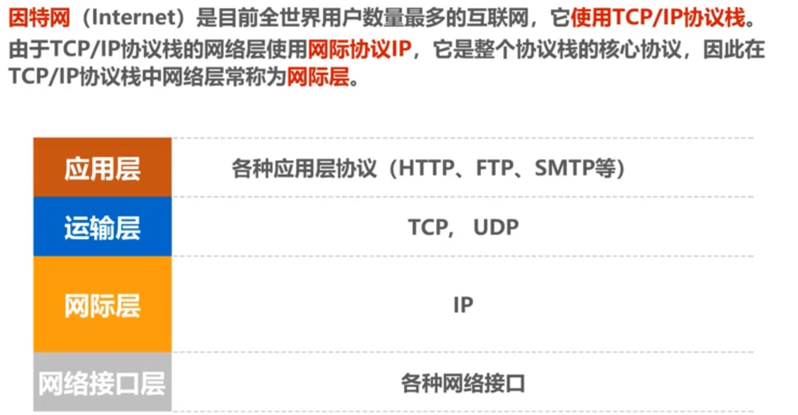

# 网络层概述
网络层的主要任务是实现网络互连，进而实现数据包在各网络之间的传输      
   

####要实现网络层任务，需要解决以下主要问题：
###### 网络层向运输层提供怎样的服务
因特尔使用的TCP/IP协议体系的网际层是无连接的不可靠的服务
###### 网络层寻址问题 

###### 路由选择问题 

###### TCP/IP体系结构的因特网的网际层提供的是简单灵活、无连接的、尽最大努力交付的数据报服务
  

# 网际协议ip  
### IPv4地址概述  
   
    